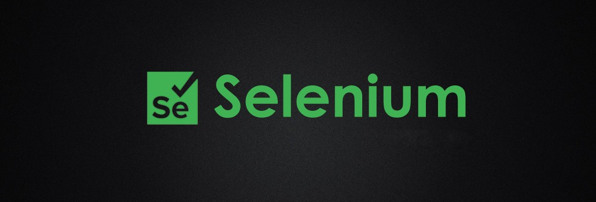

# Amazon Automation Testing

## Table of Contents

- [Introduction](#introduction)
- [Features](#features)
- [Build Process](#build-process)
- [Tech Stack](#tech-stack)

 

## Introduction

This is a selenium project which done using java for automate testing in amazon web.

## Features

🚀 Parallel execution on different browsers  
🚀 Target elements by id, classes and xpath  

## Build Process

- Clone or download the repo
- `install` related drivers
- `run` the server application

## Tech Stack

    
    
    
    
    

